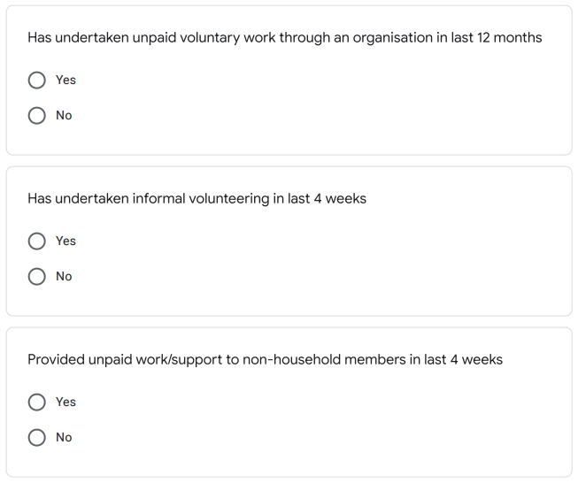
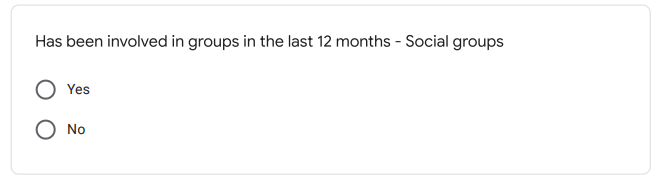
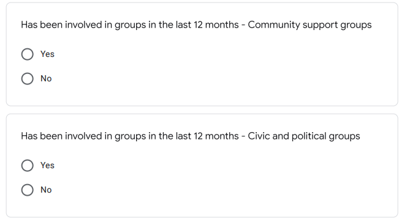
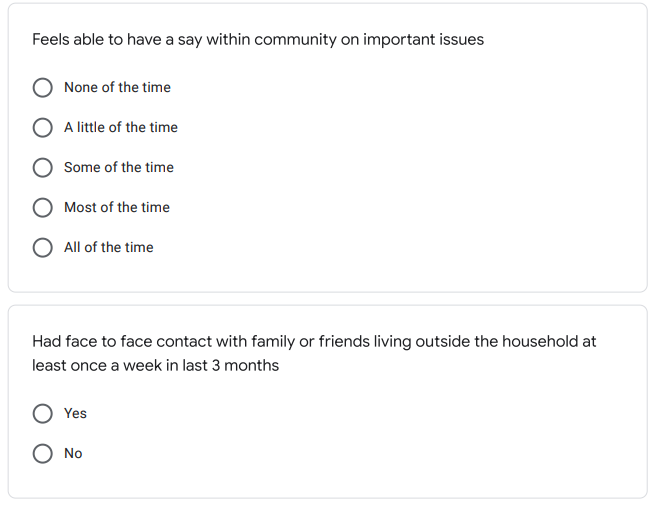
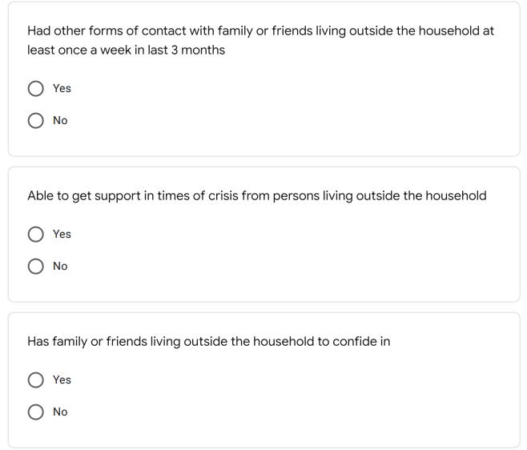
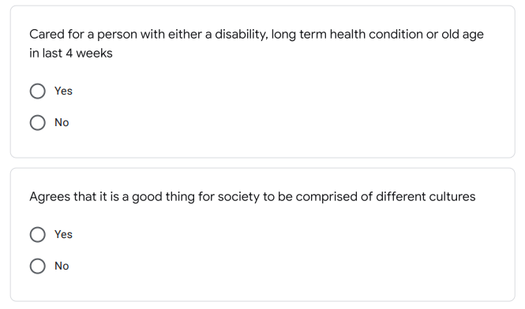
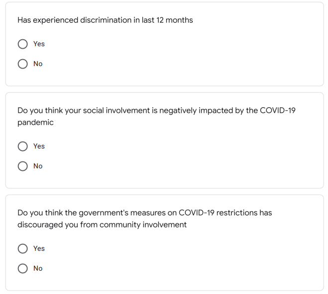

```{r setup, include=FALSE}
knitr::opts_chunk$set(echo = TRUE)
library(gridExtra)
library(tidyverse)
```

# Abstract

This paper aims to determine the impacts of the COVID-19 pandemic on Australians' social lives in different aspects such as community and family involvements, social trusts, and personal social life by studying the 2020 Australian General Social Survey results on the social experiences questionnaire. The survey result suggests that even though some disturbances are seen in social group activities, non-household family member and friends interactions, the bond with the community and people's trust in social services providers such as the healthcare system remain strong. This result indicates that the COVID-19 pandemic did not severely damage the social trust in Australia and that people have confidence in their community to overcome this global crisis.

\newpage

# Introduction

Ever since the outbreak of the COVID-19 pandemic, many regions in the world have been facing unprecedented challenges in all aspects of society. As the virus continues to spread and causes property and live casualties and governments take actions to enforce compulsory restriction measures on individuals. The usual lifestyles of people are dramatically changed, and in this particular era, it is essential for a government to ensure that people still have enough community involvement and trust.

The Australian COVID-19 outbreak started from the first confirmed case on January 23, 2020, but government restrictions were not begun to be put into practice until the second case which occurred on February 26, 2020. Australia was one of the countries that enforced the most serious restrictions at the early stage of the outbreaks in the western world. The government took immediate actions such as indoor gathering restrictions, international travel restrictions, border control measures, and stimulus payments even before WHO declared the global pandemic on March 11, 2020. As a result, the country has kept a relatively smaller infection number since the outbreak, and in 2020, the peak appeared on August 1 with daily confirmed cases of 553. This was a surprisingly good report considering many countries such as the U.S. and the U.K were suffering from healthcare system overloads at that time. Due to the government's quick responses to the outbreak and people's adaptation to the new challenges, the day-to-day lives of people in Australia were not severely impacted despite international travel restrictions. The Australian General Social Survey conducted in 2020 also revealed that people still have substantial involvement in the community and that their trust in authority systems was also kept at a high level. 

In this paper, we will examine the data collected from persons aged 15 years and over, on a questionnaire from the Australian General Social Survey focusing on indicators of social experience by age group and sex. In particular, for each survey question, we will compare the proportion of different responses using data visualization techniques with the help of the programming language R. The other questionnaires of the GSS has revealed that the overall life satisfaction of Australians dropped from 7.5 out of 10 in 2019 to 7.2 and that this trend is visible across all age groups besides people aged 70 years and over. Using our data set, we will determine whether the pandemic would also impact how people interact with their communities and their trust towards social facility groups such as the healthcare systems, police, and justice systems.

This paper will first start by introducing the survey methodology, the data collected and variable definition in the Data section. Then visualizations and interpretations of the collected data will be provided in the Results section, and in the Discussion section, there will be some conclusive insights,  weaknesses, and future steps sections. A supplementary survey, code to preprocess and visualize the data will be attached in the Appendix.

...

\newpage

# Data

## Survey Methodology

The Australian General Social Survey is conducted by the Australian Bureau of Statistics which provides data on the social characteristics, wellbeing and social experiences of people in Australia. The survey was conducted approximately yearly and focused on different topics of people's lives such as life satisfaction, community involvement, cultural tolerance and discrimination, financial stress and so on. In 2020, the Australian GSS was conducted over a 4 month period from June, 15 to September, 5 which covers the time window when COVID-19 was most severe in the country in that year.

The Australian GSS aims to infer the topic on all usual residents in Australia except remote areas who are aged 15 and over. In terms of geographical coverage, the survey was sent to 8768 households around Australia which excludes remote areas of the continent. The sampling frame is a list of Australian areas, and then within each area, households were randomly selected from each selected area to participate in the survey. The sample was designed to meet the aim of exploring the relative outcomes of people more vulnerable to socio-economic disadvantage, as a result, households in low socio-economic areas have a higher probability of being selected. Hence the sampling approach is similar to a simple random sampling but with a different probability allocation in the sampling frame. For a selected household, a person of 15 years of age or older is randomly selected to complete the questionnaire. As an adaptation to the pandemic, the survey was completed online or via a telephone interview without any face-to-face interviews. 

The questionnaire used in this study focuses on understanding the distribution of opinions in different social experiences across age groups. The questionnaire contains questions of three categories. The first category is community life such as community involvement, social group involvement, family support, and whether the interviewee feels able to have a say within the community on important issues. The second category is about trust in social service providers, which includes trust in the general people, healthcare system, police, and justice system. The third category is about personal social life, such as stress, crime and safety, and self-assessed health conditions. The questionnaire is strong in a way that it "provides information on the multi-dimensional nature of relative advantage and disadvantage across the population", but its disadvantage is being too lengthy so respondents may fail to provide the most carefully-thought answers in later questions which could also become a source of bias.

In the 2020 GSS, out of 8768 households, 5304 of them completed the survey, the response distribution is as shown in Table 1 below where the data is collected from the official website of Australian GSS. Due to the COVID-19 pandemic, the non-response rate is higher than usual with a proportion of $37.9\%$. These records are simply kept as missing values and no imputation method was applied. This means that non-response bias would be a potential problem in this survey as we would suspect that people with stronger opinions tend to provide their answers. But since the survey interests in too many complicated factors, it is difficult to reduce this bias so we can only discuss the bias as a weakness in the survey. Also, the fact that remote areas were excluded is unlikely to impact the national estimates because these regions are not in the interest of inferencing by GSS.

```{r, echo=FALSE, warning=FALSE, message=FALSE}
res <- data.frame(Response=c("Fully Responding", "Refusal", "Non-Response", "Part-Response", "Total Non-Response", "Sample Size"), 
                  Number=c(5304, 79, 3327, 58, 3464, 8768), 
                  Proportion=c(60.5, 0.9, 37.9, 0.7, 39.5, 100))
knitr::kable(res, caption="2020 GSS Response Distribution")
```

## Estimation and Data Releases

As a measure to protect the privacy of respondents and to avoid any legal concern, the raw data collected by the GSS officials are not released to the public and only the processed data set after the estimation method has been applied are open sources.

The individual respondent's opinions are converted to estimates for the whole Australian population using a weighting method. Each person or household was given a weight to reflect the number of people they represented in the population. The weights are all calibrated to align with other independent estimates in the in-scope population, and additional information is also used to ensure that the estimates represent people or households that were similar to the actual responding households, and that they approximately reflect the distribution of the population.

According to the supplementary survey provided in Appendix 1. The results, after the estimation method is applied, were simply the number of individuals in Australia except for remote areas who would select a specific answer on a question. The questions are of two types, where the opinion question has five possible choices ordered by opinion standpoint and strength, and the yes-or-no question has only two choices. In particular, for each question, the possible answers are:

**Opinion questions**: according to specific questions,

- *None of the time*, *a little of the time*, *some of the time*, *most of the time*, *all of the time*
- *Strongly disagree*, *somewhat disagree*, *neither agree nor disagree*, *somewhat agree*, *strongly agree*
- *Poor*, *fair*, *good*, *very good*, *excellent*

**Yes-or-no questions**: *Yes*, *No*

The frequency (the number of estimated people who choose a specific choice) of each choice of each question is recorded as a numerical variable, and this would be the main variable to discuss. The age group and sex of each respondent are also recorded and then transfer to the estimate, and these two are both categorical variables defined as below.

- `Age Group`: *15-24*, *24-39*, *40-54*, *55-69*, *70 and over*
- `Sex`: *F* (Female), *M* (Male)

Figure 1 gives us the estimated total number of individuals of each combination of age group and sex based on the GSS survey responses. The number totals up to $20265.2$ thousand of people which represent the Australian population except for remote areas and Northern Territory in 2020. In the next section, we will analyze the response distribution of each survey question and relate the results to the Australian society in 2020.

Based on the above estimate of the population size by age group and sex, we will use the proportion of each choice of each question as our variable of interest, which is a numerical variable with possible values from 0 to 100. We use the proportion as it is easier and intuitive to interpret and that it can be easily scaled to the estimated number of individuals using the estimates as in Figure 1.

```{r, echo=FALSE, warning=FALSE, fig.height=8, message=FALSE, fig.cap="Estimated Number of Individual (in Thousands) by Age Group and Sex", fig.fullwidth=TRUE}
# Reading the open source data file from package
data <- readxl::read_xlsx("data/GSS_Table2.xlsx", sheet=4, skip=6)
data.total <- readxl::read_xlsx("data/GSS_Table2.xlsx", sheet=2, skip=6)

# Preparing the data: extract each question's response into a separate data frame
#     and convert the first column value type from string to double
#     also separate male and female according to structrue of the XLSX file
comm_involvement_m <- data[4:6,1:6]
comm_involvement_m$`15–24` <- as.double(comm_involvement_m$`15–24`)
comm_groups_involvement_m <- data[9:11,1:6]
comm_groups_involvement_m$`15–24` <- as.double(comm_groups_involvement_m$`15–24`)
comm_say_m <- data[14:16,1:6]
comm_say_m$`15–24` <- as.double(comm_say_m$`15–24`)
comm_support_m <- data[19:23,1:6]
comm_support_m$`15–24` <- as.double(comm_support_m$`15–24`)
comm_cultural_tolerance_m <- data[26:27,1:6]
comm_cultural_tolerance_m$`15–24` <- as.double(comm_cultural_tolerance_m$`15–24`)
trust_people_m <- data[31:33,1:6]
trust_people_m$`15–24` <- as.double(trust_people_m$`15–24`)
trust_hc_system_m <- data[36:38,1:6]
trust_hc_system_m$`15–24` <- as.double(trust_hc_system_m$`15–24`)
trust_police_m <- data[41:43,1:6]
trust_police_m$`15–24` <- as.double(trust_police_m$`15–24`)
trust_justice_sys_m <- data[46:48,1:6]
trust_justice_sys_m$`15–24` <- as.double(trust_justice_sys_m$`15–24`)
stressors_m <- data[51:54,1:6]
stressors_m$`15–24` <- as.double(stressors_m$`15–24`)
crime_and_safety_m <- data[57:58,1:6]
crime_and_safety_m$`15–24` <- as.double(crime_and_safety_m$`15–24`)
health_m <- data[62:64,1:6]
health_m$`15–24` <- as.double(health_m$`15–24`)

comm_involvement_f <- data[74:76,1:6]
comm_involvement_f$`15–24` <- as.double(comm_involvement_f$`15–24`)
comm_groups_involvement_f <- data[79:81,1:6]
comm_groups_involvement_f$`15–24` <- as.double(comm_groups_involvement_f$`15–24`)
comm_say_f <- data[84:86,1:6]
comm_say_f$`15–24` <- as.double(comm_say_f$`15–24`)
comm_support_f <- data[89:93,1:6]
comm_support_f$`15–24` <- as.double(comm_support_f$`15–24`)
comm_cultural_tolerance_f <- data[96:97,1:6]
comm_cultural_tolerance_f$`15–24` <- as.double(comm_cultural_tolerance_f$`15–24`)
trust_people_f <- data[101:103,1:6]
trust_people_f$`15–24` <- as.double(trust_people_f$`15–24`)
trust_hc_system_f <- data[106:108,1:6]
trust_hc_system_f$`15–24` <- as.double(trust_hc_system_f$`15–24`)
trust_police_f <- data[111:113,1:6]
trust_police_f$`15–24` <- as.double(trust_police_f$`15–24`)
trust_justice_sys_f <- data[116:118,1:6]
trust_justice_sys_f$`15–24` <- as.double(trust_justice_sys_f$`15–24`)
stressors_f <- data[121:124,1:6]
stressors_f$`15–24` <- as.double(stressors_f$`15–24`)
crime_and_safety_f <- data[127:128,1:6]
crime_and_safety_f$`15–24` <- as.double(crime_and_safety_f$`15–24`)
health_f <- data[132:134,1:6]
health_f$`15–24` <- as.double(health_f$`15–24`)

total_male <- data.total[70,1:6]; total_male$`15–24` <- as.double(total_male$`15–24`)
total_female <- data.total[140,1:6]; total_female$`15–24` <- as.double(total_female$`15–24`)
total_ppl <- data.total[210,1:6]
total_male %>%
  pivot_longer(-...1, names_to="age_group", values_to="count") %>%
  mutate(Sex="M") %>%
  bind_rows(total_female %>% 
              pivot_longer(-...1, names_to="age_group", values_to="count") %>%
              mutate(Sex="F")) %>%
  rename(Response=...1) %>%
  ggplot(aes(x=Response, y=count, fill=age_group)) +
  geom_bar(stat="identity", width=.8, position="dodge") +
  labs(
    x="Sex", y="Estimasted Number of Individuals, in Thousands"
  )
```

\newpage

# Results

## Community and Family Involvement

This section considers the involvements of Australian individuals' community and social groups in terms of volunteering activities and their interactions between household and non-household members. 

In Figure 2, we see that people across both sex and all age groups have substantial community involvement in forms of volunteering and unpaid work support. The amount of support provided to the non-households member from these people shows that even under the pandemic situation, Australians still spend a significant amount of time with their community and that the most active group of people are from the `55-69` age group across both sexes.

Figure 3 also indicates that Australians tend to spend more time in social environments and care less about civic and political matters. This could be a sign that the people are having a high standard of life as they do not need to worry about political uncertainties and they have enough confidence in their community. We also observe that young males are very active in social groups and this could be because their school environments encourage social activities. But according to the previous year's data, a slight decrease in the numbers is present which is potentially due to the pandemic.

In Figure 4, we especially notice two things. First, about $90\%$ of the people who are able to get support in times of crisis from persons living outside the household. This is a high number given the pandemic restrictions and it does not show a decrease compared to the previous year's data. This means that the community bond in Australia is relatively strong and this is not impacted by the COVID-19 pandemic. However, there is only about $40\%$ of people who face to face contact with family or friends living outside their household in 2020 at least once a week. This number shows a gap between the previous observations, but it further justifies that even though restrictions are exercised, the community and family bond still remain strong.

## Trust in Social Services Providers

This section mainly investigates how much trust Australians have towards their social services providers such as the healthcare system, police and justice system, and the general public.

In Figure 5 we see that about $60\%$ of people agree that most people can be trusted, and this is a good indicator of society with good credit. However, we do find that males tend to be more optimistic in this aspect than females, and this may result from complicated factors possibly relating to gender inequality not being completely achieved. In particular, young females have greater doubts about most people.

The trust in the healthcare system as shown in Figure 6 displays some optimistic results under this special time. There are more than $75\%$ of Australians who agreed that the healthcare system can be trusted, and this indicates that the people have confidence in overcoming the pandemic and that the healthcare system did not undergo severe burdens in 2020. 

The trust people have in the police and justice system also has similar structure as with the healthcare system. However, we do find that the trust in the justice system is the lowest among all four objects in this section. This may be an indicator of some potential social problems of injustice, and there is also a slight decrease compared to the 2019 results.

## Personal Social Life

This section contains questions on personal stressors, crime and safety concerns as well as self-assessed health conditions.

Figure 9 indicates that society, in general, has a relatively high-stress level with about $30-40\%$ of individuals always or often feeling rushed for time, and $50-60\%$ of individuals experienced at least one personal stressor in the last 12 months. Especially, we found that despite people aged 70 years and over, older people tend to suffer from stress more, and this could stem from multiple sources such as family, career, and financial burdens. We also notice that females are generally more stressed than males.

There is about 1 in 20 people who experienced actual or attempted break-in, and/or physical or threatened assault in the last 12 months (Figure 10), and this ratio gets even larger for females of age 15 to 24. 

Since there was a global crisis of pandemics in 2020, we would expect that more people have concerns about their own health conditions. However, the self-assessed health results do not exhibit a significant increase in people who choose fair and/or poor compared to the previous year. In fact, even though the ratio decreases as age increases, there is still about $50\%$ of individuals who believe that their health is in excellent condition. This could also be an indicator of successful control of the pandemic in Australia in 2020.

```{r, echo=FALSE, warning=FALSE, fig.height=8, message=FALSE, fig.cap="Community Involvement Answers by Age Group", fig.fullwidth=TRUE}
comm_involvement_m %>%
  pivot_longer(-...1, names_to="age_group", values_to="proportion") %>%
  mutate(Sex="M") %>%
  bind_rows(comm_involvement_f %>%
              pivot_longer(-...1, names_to="age_group", values_to="proportion") %>%
              mutate(Sex="F")) %>%
  rename(Response=...1) %>%
  ggplot(aes(x=Response, y=proportion, fill=age_group)) +
  geom_bar(stat="identity", width=.8, position="dodge") + 
  theme(axis.text.x=element_text(angle=60, hjust=1)) + 
  facet_wrap(~Sex) + 
  labs(
    x="Response", y="Proportion", 
    title="Question Category: Community Involvement"
  )
```


```{r, echo=FALSE, warning=FALSE, fig.height=8, message=FALSE, fig.cap="Groups or not Answers by Age Group", fig.fullwidth=TRUE}
comm_groups_involvement_m %>%
  pivot_longer(-...1, names_to="age_group", values_to="proportion") %>%
  mutate(Sex="M") %>%
  bind_rows(comm_groups_involvement_f %>%
              pivot_longer(-...1, names_to="age_group", values_to="proportion") %>%
              mutate(Sex="F")) %>%
  rename(Response=...1) %>%
  ggplot(aes(x=Response, y=proportion, fill=age_group)) +
  geom_bar(stat="identity", width=.8, position="dodge") + 
  theme(axis.text.x=element_text(angle=60, hjust=1)) + 
  facet_wrap(~Sex) + 
  labs(
    x="Response", y="Proportion", 
    title="Question: Has been involved in groups in the last 12 months"
  )
```


```{r, echo=FALSE, warning=FALSE, fig.height=8, message=FALSE, fig.cap="Family and community support Answers by Age Group", fig.fullwidth=TRUE}
comm_support_m %>%
  pivot_longer(-...1, names_to="age_group", values_to="proportion") %>%
  mutate(Sex="M") %>%
  bind_rows(comm_support_f %>%
              pivot_longer(-...1, names_to="age_group", values_to="proportion") %>%
              mutate(Sex="F")) %>%
  rename(Response=...1) %>%
  ggplot(aes(x=Response, y=proportion, fill=age_group)) +
  geom_bar(stat="identity", width=.8, position="dodge") + 
  theme(axis.text.x=element_text(angle=60, hjust=1)) + 
  facet_wrap(~Sex) + 
  labs(
    x="Response", y="Proportion", 
    title="Question Category: Family and community support"
  )
```

```{r, echo=FALSE, warning=FALSE, fig.height=8, message=FALSE, fig.cap="Trust Test Answers by Age Group", fig.fullwidth=TRUE}
trust_people_m %>%
  pivot_longer(-...1, names_to="age_group", values_to="proportion") %>%
  mutate(Sex="M") %>%
  bind_rows(trust_people_f %>%
              pivot_longer(-...1, names_to="age_group", values_to="proportion") %>%
              mutate(Sex="F")) %>%
  rename(Response=...1) %>%
  ggplot(aes(x=Response, y=proportion, fill=age_group)) +
  geom_bar(stat="identity", width=.8, position="dodge") + 
  theme(axis.text.x=element_text(angle=60, hjust=1)) + 
  facet_wrap(~Sex) + 
  labs(
    x="Response", y="Proportion", 
    title="Question: Feels most people can be trusted"
  )
```

```{r, echo=FALSE, warning=FALSE, fig.height=8, message=FALSE, fig.cap="Healthcare System Trust Answers by Age Group", fig.fullwidth=TRUE}
trust_hc_system_m %>%
  pivot_longer(-...1, names_to="age_group", values_to="proportion") %>%
  mutate(Sex="M") %>%
  bind_rows(trust_hc_system_f %>%
              pivot_longer(-...1, names_to="age_group", values_to="proportion") %>%
              mutate(Sex="F")) %>%
  rename(Response=...1) %>%
  ggplot(aes(x=Response, y=proportion, fill=age_group)) +
  geom_bar(stat="identity", width=.8, position="dodge") + 
  theme(axis.text.x=element_text(angle=60, hjust=1)) + 
  facet_wrap(~Sex) + 
  labs(
    x="Response", y="Proportion", 
    title="Question: Feels the healthcare system can be trusted"
  )
```

```{r, echo=FALSE, warning=FALSE, fig.height=8, message=FALSE, fig.cap="Police trust Answers by Age Group", fig.fullwidth=TRUE}
trust_police_m %>%
  pivot_longer(-...1, names_to="age_group", values_to="proportion") %>%
  mutate(Sex="M") %>%
  bind_rows(trust_police_f %>%
              pivot_longer(-...1, names_to="age_group", values_to="proportion") %>%
              mutate(Sex="F")) %>%
  rename(Response=...1) %>%
  ggplot(aes(x=Response, y=proportion, fill=age_group)) +
  geom_bar(stat="identity", width=.8, position="dodge") + 
  theme(axis.text.x=element_text(angle=60, hjust=1)) + 
  facet_wrap(~Sex) + 
  labs(
    x="Response", y="Proportion", 
    title="Question: Feels police can be trusted"
  )
```

```{r, echo=FALSE, warning=FALSE, fig.height=8, message=FALSE, fig.cap="Justice System Trust Answers by Age Group", fig.fullwidth=TRUE}
trust_justice_sys_m %>%
  pivot_longer(-...1, names_to="age_group", values_to="proportion") %>%
  mutate(Sex="M") %>%
  bind_rows(trust_justice_sys_f %>%
              pivot_longer(-...1, names_to="age_group", values_to="proportion") %>%
              mutate(Sex="F")) %>%
  rename(Response=...1) %>%
  ggplot(aes(x=Response, y=proportion, fill=age_group)) +
  geom_bar(stat="identity", width=.8, position="dodge") + 
  theme(axis.text.x=element_text(angle=60, hjust=1)) + 
  facet_wrap(~Sex) + 
  labs(
    x="Response", y="Proportion", 
    title="Question: Feels the justice system can be trusted"
  )
```

```{r, echo=FALSE, warning=FALSE, fig.height=8, message=FALSE, fig.cap="Stressors Answers by Age Group", fig.fullwidth=TRUE}
stressors_m %>%
  pivot_longer(-...1, names_to="age_group", values_to="proportion") %>%
  mutate(Sex="M") %>%
  bind_rows(stressors_f %>%
              pivot_longer(-...1, names_to="age_group", values_to="proportion") %>%
              mutate(Sex="F")) %>%
  rename(Response=...1) %>%
  ggplot(aes(x=Response, y=proportion, fill=age_group)) +
  geom_bar(stat="identity", width=.8, position="dodge") + 
  theme(axis.text.x=element_text(angle=60, hjust=1)) + 
  facet_wrap(~Sex) + 
  labs(
    x="Response", y="Proportion", 
    title="Question Category: Stressors"
  )
```

```{r, echo=FALSE, warning=FALSE, fig.height=8, message=FALSE, fig.cap="Life Safety Answers by Age Group", fig.fullwidth=TRUE}
crime_and_safety_m %>%
  pivot_longer(-...1, names_to="age_group", values_to="proportion") %>%
  mutate(Sex="M") %>%
  bind_rows(crime_and_safety_f %>%
              pivot_longer(-...1, names_to="age_group", values_to="proportion") %>%
              mutate(Sex="F")) %>%
  rename(Response=...1) %>%
  ggplot(aes(x=Response, y=proportion, fill=age_group)) +
  geom_bar(stat="identity", width=.8, position="dodge") + 
  theme(axis.text.x=element_text(angle=60, hjust=1)) + 
  facet_wrap(~Sex) + 
  labs(
    x="Response", y="Proportion", 
    title="Question Category: Crime and Safety"
  )
```

```{r, echo=FALSE, warning=FALSE, fig.height=8, message=FALSE, fig.cap="Health Status Answers by Age Group", fig.fullwidth=TRUE}
health_m %>%
  pivot_longer(-...1, names_to="age_group", values_to="proportion") %>%
  mutate(Sex="M") %>%
  bind_rows(health_f %>%
              pivot_longer(-...1, names_to="age_group", values_to="proportion") %>%
              mutate(Sex="F")) %>%
  rename(Response=...1) %>%
  ggplot(aes(x=Response, y=proportion, fill=age_group)) +
  geom_bar(stat="identity", width=.8, position="dodge") + 
  theme(axis.text.x=element_text(angle=60, hjust=1)) + 
  facet_wrap(~Sex) + 
  labs(
    x="Response", y="Proportion", 
    title="Question Category:	Self-assessed health status"
  )
```

\newpage

# Discussion

## Conclusion

It has been more than two years since the COVID-19 pandemic began, and the impact of the pandemic on Australian citizens' life is huge. In order to help the Australian government better understand the impact of the epidemic on people's lives, an investigation of them is necessary.

In general, in this paper, we use the social experiences questionnaire in the 2020 Australian General Social Survey as our dataset, the survey was sent to 8768 households around Australia, the families were randomly selected from each area to participate in the survey. By visualizing, analyzing, and interpreting the estimated results, we could determine the degree of impact the COVID-19 pandemic had on Australians' social lives. 

According to the above analysis of the survey results, we see that the COVID-19 pandemic in 2020 does impact people's lifestyles and opinions in some ways. We decide to figure out the Community and Family Involvement, Trust in Social Services Providers and Personal Social Life for Australian families after the pandemic. For example, from the survey, people have fewer face-to-face interactions with non-household family members and friends, people spend less time in social and community groups that require indoor or outdoor gatherings. However, these impacts do not significantly hurt their opinions on the trustworthiness of their community. In particular, we found that people are still able to find support from the community in this unprecedented time and that people still have high trust in the national healthcare systems. More importantly, to obtain more information and to understand how the pandemics directly affected them, we have added a questionnaire to the appendix to improve the accuracy of the survey.

## Learn about the world

Based on our results and figures, we found that the way Australians live and socialize has been greatly affected by the pandemic. These can be grouped into three main parts, Community and Family Involvement, Trust in Social Services Providers and Personal Social Life.

In Community and Family Involvement area, we found that in 2020, only 40% of people had face-to-face contact with family and friends living outside their home at least once a week, however, it was 90% before the pandemic. The decline in this data is due to the pandemic safety distance policy. At the beginning of the epidemic, the Australian government recommended reducing the times of going out to control the spread of the virus, which led to fewer meetings between family and friends. Nevertheless, the 40% figure is still high, which shows that, though there is a restriction rule, the community and family bonds still remain strong.

For the Social Services Trust side, we found that 75% of Australians believe the healthcare system can be trusted. This shows that the Australian government has properly controlled the epidemic, the people have confidence in defeating the epidemic and believe that the medical system can give them effective treatment after they fall ill, allowing them to recover.

Among Providers and Personal Social Life part, the most surprising stats are that approximately 30-40% of individuals are always or frequently feeling stress, while 50-60% experience at least one type of personal stressors. Among these people, those over 70 tend to experience more stress. These pressures not only come from society or the family but financial burdens. We suggest that the government can provide relief funds to needy families and set up foundations to help people who have lost their jobs due to the pandemic. For those young people with a stressful life, free psychological counselling services can be set up to relieve their depressed emotions during the epidemic.

## Weaknesses and Next Steps

Even though we are able to deduce some insights from the data, there are still drawbacks we should acknowledge in this study. First, the non-response rate in this survey reaches above $30\%$ meaning that we may have a substantial amount of non-response bias left to address. Also, the fact that the survey does not consider people in remote areas of Australia makes the results less applicable to the complete Australian population, especially knowing that the Northern Territory has about $21\%$ of the national population. Additionally, we reach the above results only by visualizing the data and comparing it to the officially published 2019 survey results, but these observational surveys cannot allow us to conclude any causal effects. This means that we cannot be sure that the above-mentioned changes are caused by the pandemic.

There are also some future steps that we can take to make the study more applicable. First, for these proportion estimates, we can also consider the standard errors of them to discuss the variability in the estimates and talk about the causes of variations. We can also fit some statistical models to capture the correlations between some of the data. For example, we may want to determine the relationship between the self-assessed health condition and people's trust in the healthcare system.

\newpage


# Appendix

## Supplementary Survey

### Survey introduction

Dear participants,

Thank you for opening joining this questionnaire. The estimated time to complete the questionnaire is 5-10 minutes. This questionnaire is to study the impact of the COVID-19 pandemic on Australian citizens in the Family, Social trust, and Health status areas. All data will directly enter the Australian Government Statistics system for statistical analysis and your personal information will never be leaked.

Sincerely,

Government of Australian

### The questionnaire

A supplementary questionnaire of the studied Australian GSS portion can be found in this link: https://forms.gle/4jGGyEHRkPvmmKGY7.

Note that this supplementary survey is an augmented version to address the weakness of being unable to deduce causal effect between changes in response and the COVID-19 pandemic.


```{r,echo=FALSE, fig.align='center', out.width = '80%'}
# screenshot for the survey








```


\newpage

# Reference

Australian Bureau of Statistics (2022). General Social Survey: Summary Results, Australia. Australian GSS data source, 2020. https://www.abs.gov.au/statistics/people/people-and-communities/general-social-survey-summary-results-australia/2020#data-download

Australian Bureau of Statistics (2022). General Social Survey: Summary Results, Australia methodology, 2020. https://www.abs.gov.au/methodologies/general-social-survey-summary-results-australia-methodology/2020

John Hopkins University of Medicine, Coronavirus Resource Center (2022). Australia - COVID-19 Overview - John Hopkins. https://coronavirus.jhu.edu/region/australia

R Core Team (2020). R: A language and environment for statistical computing. R Foundation for Statistical Computing, Vienna, Austria. URL: https://www.R-project.org/.

Wickham et al., (2019). Welcome to the tidyverse. Journal of Open Source Software, 4(43),  1686, https://doi.org/10.21105/joss.01686

Yihui Xie (2021). knitr: A General-Purpose Package for Dynamic Report Generation in R. CRAN R Project. https://cran.r-project.org/web/packages/knitr/index.html


